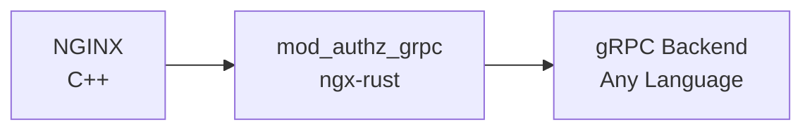

**WORK IN PROGRESS**

This is a Coraza gRPC backend. It exposes a single Request message called HttpFilter, 
and this message should contain the common request payload + a oneof type of Request or Response.

It will return a Decision on the same models of Coraza/mod_security Transaction/decision.

This backend will be inspired on the already amazing [coraza-spoa](https://github.com/corazawaf/coraza-spoa).
We are probably going to use the same cache idea for requests vs responses, a similar approach to create 
Coraza decision points.

The Nginx Rust module will be developed simply to consume this program via gRPC and take decisions based on 
the return of this module

## What's the architectural idea

## Why create a new backend?
We need to replace mod_security on ingress nginx. While some other solutions can be used (and we love them),
they are based on Lua integration, which means it needs openresty.

Coraza also has integration with NGINX via C++ code, but this means we need people willing to develop on C++
which can make our bar too high

## What's the final idea?

There's a heavy work ongoing by Nginx team to expose NGINX module creation via Rust.

This way, the idea is "wait, we can use the same HAProxy SPOA approach for NGINX, but using the well known gRPC
to exchange messages".

Although this idea was focused on consuming Coraza on NGINX (and without relying on C++ code), the goal is 
to create a "common authorizer" integration between NGINX and Go programs, using gRPC and with a boilerplate
module on Rust.

So Rust can be used to defer a decision to some backend, using gRPC communication, which means the decision backend
can be written on any language that implements this Protobuf: Java, Go, etc.

Thinking "bigger", a gRPC backend can decide based on headers, can pass to some OAuth provider that redirects 
the user to an authentication page and then checks the JWT headers after that and so on.

## What about performance?
This is a point that needs to be tested. Heavily tested. An authorization backend will always have a penalty
versus something running together with Nginx (like a shared module). You still need to open a connection to 
the backend, keep it alive, etc.

There is a plan to do some benchmarks.
